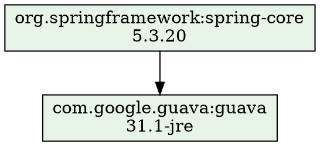

# CLI Commands

All 7 subcommands with usage details.

## `graph`

Output the dependency tree in Graphviz DOT format.

```bash
gradle-dependency-check graph <project_path> [-c configuration] [-m module] [--list-modules]
```

**Example output:**


Conflict nodes use `fillcolor="#ffcccc"` (red). Pipe to `dot -Tpng -o graph.png` for rendering.

**When to use:** Generate visual dependency graphs for documentation or reviews.

## `conflicts`

Report dependencies where the resolved version differs from the requested version.

```bash
gradle-dependency-check conflicts <project_path> [-c config] [-m module] [-f text|json]
```

**Text output:**
```
Dependency Conflicts in my-project (Compile Classpath)
============================================================

  com.fasterxml.jackson.core:jackson-databind
    2.13.0 -> 2.14.2 (requested by org.springframework:spring-web)

Total: 1 conflict(s) across 1 dependency(ies)
```

**JSON output:**
```json
{
  "projectName": "my-project",
  "configuration": "compileClasspath",
  "conflictCount": 1,
  "conflicts": [
    {
      "coordinate": "com.fasterxml.jackson.core:jackson-databind",
      "requestedVersion": "2.13.0",
      "resolvedVersion": "2.14.2",
      "requestedBy": "org.springframework:spring-web"
    }
  ]
}
```

**When to use:** CI checks to detect or track version conflicts.

## `table`

List all unique dependencies in a flat table.

```bash
gradle-dependency-check table <project_path> [-c config] [-m module] [-f text|json] [--conflicts-only]
```

**Text output:**
```
Dependencies in my-project (Compile Classpath)
============================================================

  com.google.guava:guava:31.1-jre
    used by: org.springframework:spring-core
  org.slf4j:slf4j-api:1.7.36
    used by: org.springframework:spring-core

Total: 2 unique dependency(ies)
```

Use `--conflicts-only` to filter to entries with version conflicts.

**When to use:** Get a quick flat inventory of all dependencies, or audit which dependencies have conflicts.

## `validate`

Check for test libraries in production dependency scopes.

```bash
gradle-dependency-check validate <project_path> [-c config] [-m module] [-f text|json]
```

**Text output:**
```
Scope Validation Issues in my-project (Compile Classpath)
============================================================

  junit:junit:4.13.2
    detected as: JUnit 4
    recommendation: Move to testImplementation or testRuntimeOnly

Total: 1 issue(s)
```

**JSON output:**
```json
{
  "projectName": "my-project",
  "configuration": "compileClasspath",
  "issueCount": 1,
  "issues": [
    {
      "coordinate": "junit:junit",
      "version": "4.13.2",
      "matchedLibrary": "JUnit 4",
      "configuration": "compileClasspath",
      "recommendation": "Move to testImplementation or testRuntimeOnly"
    }
  ]
}
```

Only runs on production configurations. Returns empty for test configurations.

**When to use:** CI gate to prevent test libraries from shipping in production artifacts.

## `duplicates`

Detect duplicate dependencies across or within modules.

```bash
gradle-dependency-check duplicates <project_path> [-c config] [-m module] [-f text|json]
```

**Text output:**
```
Duplicate Dependencies in my-project (Compile Classpath)
============================================================

Cross-module duplicates:

  com.google.guava:guava [VERSION MISMATCH]
    modules: app, core
    app: 31.1-jre
    core: 30.0-jre
    recommendation: Version mismatch — standardize

Total: 1 duplicate(s) (1 cross-module, 0 within-module)
```

**When to use:** Find version inconsistencies across modules or unnecessary duplicate declarations in build files.

## `diff`

Compare two dependency trees. Each argument can be a project directory or an exported file.

```bash
gradle-dependency-check diff <baseline> <current> [-c config] [-m module] [-f text|json] [--changes filter]
```

**Text output:**
```
Dependency Diff: baseline → current
============================================================

Summary: 1 added, 1 removed, 1 changed

  + com.example:new-lib:1.0.0
  - com.example:old-lib:2.0.0
  ~ com.google.guava:guava: 30.0-jre → 31.1-jre
```

**Filtering with `--changes`:**
```bash
# Show only added and removed
gradle-dependency-check diff ./v1 ./v2 --changes added,removed

# Show everything including unchanged
gradle-dependency-check diff ./v1 ./v2 --changes added,removed,changed,unchanged
```

By default, unchanged entries are hidden.

**When to use:** CI pipelines to detect dependency drift between branches, releases, or snapshots.

## `export`

Export the dependency tree for archival or later diffing.

```bash
gradle-dependency-check export <project_path> [-c config] [-m module] [-f json|text]
```

Default format is JSON. JSON output is the full `DependencyTree` serialized via serde. Text output reproduces the Gradle ASCII tree format.

**When to use:** Save a snapshot of dependencies for later comparison with `diff`.

## Common Patterns

### List modules first
```bash
gradle-dependency-check conflicts ./my-project --list-modules
# :app
# :core
# :data
```

### Target a specific module
```bash
gradle-dependency-check table ./my-project -m :app
```

### Use a non-default configuration
```bash
gradle-dependency-check conflicts ./my-project -c runtimeClasspath
```
